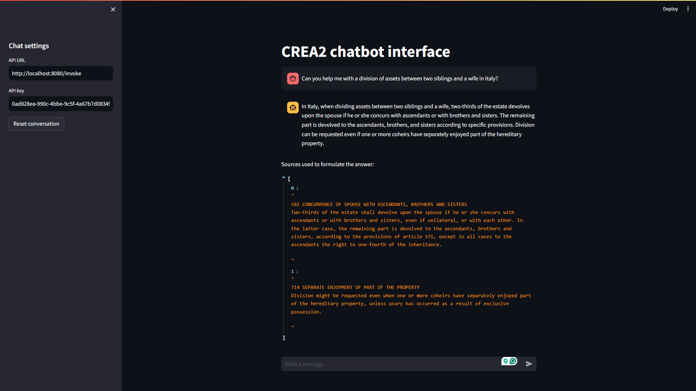

# CREA2 LangChain Agent Server

## Overview
CREA2 LangChain Agent Server is an API server built using FastAPI, designed to serve as an interface to a sophisticated stateful chatbot agent. This agent is capable of assisting users with legal queries related to divorce and inheritance division of assets. Powered by AI-driven tools and access to a curated collection of laws and past legal cases, the chatbot provides insightful and transparent responses to user queries. The chatbot maintains statefulness by preserving the chat history for 10 minutes after the last message in Redis for each unique session id. This allows for context-aware responses and analysis.

## Functionality
The server exposes two endpoints:

1. `/invoke`: This endpoint accepts user queries and returns responses generated by the chatbot agent. It requires the following parameters in a JSON object in the request body:
   - `input`: The user query intended for the chatbot.
   - `session_id`: A unique identifier for the conversation session.
   
   Additionally, it requires the following parameters within the header to handle authentication:
   - `Api-Key`: A secret API key for authentication.

   Upon receiving a user query, the server interacts with the chatbot agent, which processes the query utilizing AI-driven tools and access to legal documents. The chatbot generates a response along with relevant sources of information, if any.

   Example Request for `POST /invoke`:

   JSON object
   ```json
   {
     "input": "What are the requirements for inheritance in Belgium?",
     "session_id": "123456789"
   }
   ```
   Headers
   ```http
   Api-Key: your-secret-api-key
   ```

   Example Response
   ```json
   {
     "answer": "The requirements for inheritance in Belgium are...",
     "sources": ["source1", "source2", "source3"]
   }
   ```

2. `/health`: This endpoint returns the health status of the service. It does not require any inputs and can be used to check if the server is running properly.

   Example Request for `GET /health`:
   
   Example Response
   ```json
   {
     "status": "running"
   }
   ```

## Docker Deployment (Local)
To deploy the CREA2 LangChain Agent Server locally using Docker, follow these steps:

1. **Build the Docker Image**: Navigate to the root directory of the repository and run the following command to build the Docker image:
    ```
    docker build . -t crea2/chatbot
    ```

2. **Run the Docker Multi-Container App**: Execute the following command to compose and run the Docker container, exposing port 8080 and passing the required environment variables:
    ```
    docker compose run -p 8080:8080 --env OPENAI_API_KEY=YOUR_OPENAI_API_KEY --env SECRET_API_KEY=YOUR-SECRET-API-KEY langchain
    ```

    Ensure to replace `YOUR_OPENAI_API_KEY` with your actual OpenAI API key and `YOUR-SECRET-API-KEY` with your actual secret API key.

3. **Optional**: To enable LangSmith tracing, add the following environment variables to the Docker run command:
    ```
    --env LANGCHAIN_TRACING_V2=true --env LANGSMITH_API_KEY=YOUR_LANGSMITH_API_KEY
    ```

    Replace `YOUR_LANGSMITH_API_KEY` with your actual LangSmith API key.

By following these steps, you can deploy and interact with the CREA2 LangChain Agent Server locally, leveraging its powerful capabilities to assist users with legal queries.

## Debugging with Streamlit App

For debugging purposes, you can utilize the Streamlit app provided in the repository. This app allows you to interact with the chatbot agent in a user-friendly web interface and observe its behavior in real-time.

Follow these steps to run the Streamlit app (make sure to have both Python and pip installed):

1. **Install Streamlit**: Install the streamlit dependency using pip:
   ```
   pip install streamlit
   ```

2. **Run the Streamlit App**: Once the dependencies are installed, run the Streamlit app by executing the following command:
   ```
   streamlit run debug.py
   ```

3. **Interact with the Chatbot**: After running the command, a new browser window or tab should open automatically, displaying the Streamlit app interface. You can now interact with the chatbot by typing queries into the input box and observing the responses displayed on the screen. Make sure to specify the correct `/invoke` endpoint URL within the API URL text box.

By utilizing the Streamlit app, you can gain insights into the chatbot's behavior, test different scenarios, and identify any issues or improvements needed in its functionality.

## Example Python Post Request using `requests` library

You can use the `requests` library in Python to make the POST request to the `/invoke` endpoint:

```python
import requests

url = "http://localhost:8080/invoke"
headers = {
    "Api-Key": "your-secret-api-key",
    "Content-Type": "application/json"
}
data = {
    "input": "What are the requirements for inheritance in Belgium?",
    "session_id": "123456789"
}

response = requests.post(url, headers=headers, json=data)

print(response.status_code)
print(response.json())
```

Replace `your-secret-api-key` with the actual secret API key you set as an environment variable when running the Docker container.

## Streamlit App Screenshots


